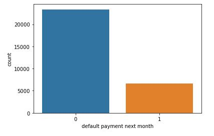
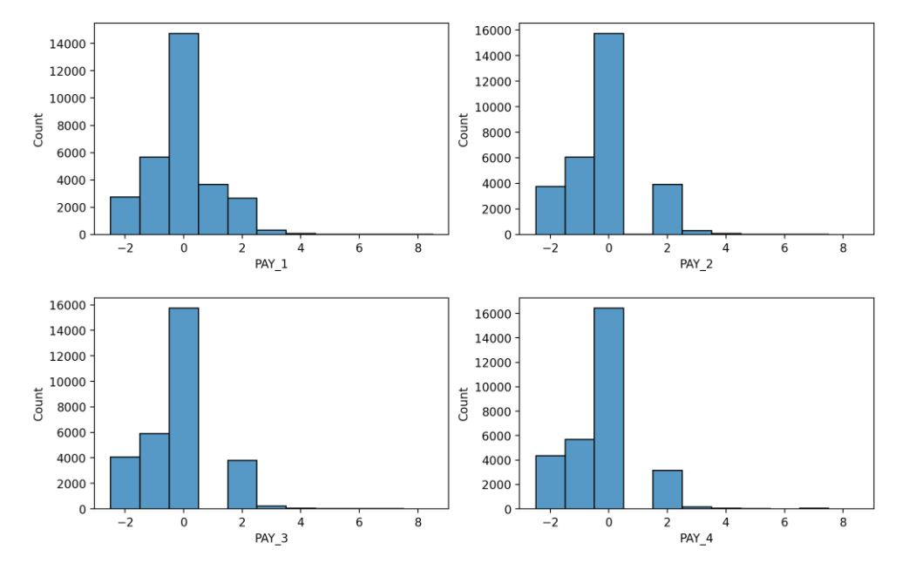
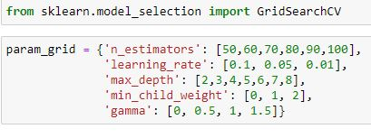
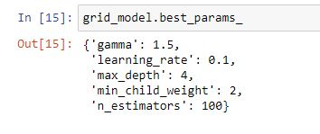
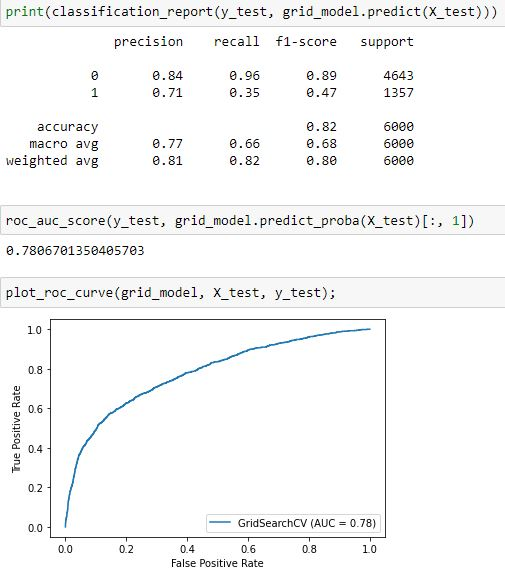
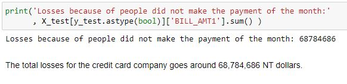
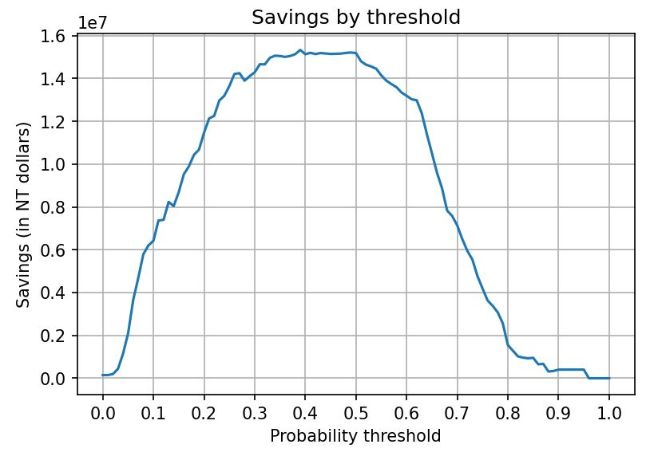
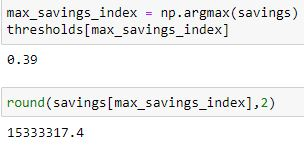

See the full project in the Jupyter Notebooks:

# Predicting Credit Card Default Project: Overview

In this problem, we will explore the [public dataset](http://archive.ics.uci.edu/ml/datasets/default+of+credit+card+clients) that comes from a credit card company. The excel file consists of 30,000 observations, 23 features and 1 response variable. The attribute information is explained in the following way:

"This research employed a binary variable, default payment (Yes = 1, No = 0), as the response variable. This study reviewed the literature and used the following 23 variables as explanatory variables:"
- X1: Amount of the given credit (NT dollar): it includes both the individual consumer credit and his/her family (supplementary) credit.
- X2: Gender (1 = male; 2 = female).
- X3: Education (1 = graduate school; 2 = university; 3 = high school; 4 = others).
- X4: Marital status (1 = married; 2 = single; 3 = others).
- X5: Age (year).
- X6 - X11: History of past payment. We tracked the past monthly payment records (from April to September, 2005) as follows: X6 = the repayment status in September, 2005; X7 = the repayment status in August, 2005; . . .;X11 = the repayment status in April, 2005. The measurement scale for the repayment status is: -1 = pay duly; 1 = payment delay for one month; 2 = payment delay for two months; . . .; 8 = payment delay for eight months; 9 = payment delay for nine months and above.
- X12-X17: Amount of bill statement (NT dollar). X12 = amount of bill statement in September, 2005; X13 = amount of bill statement in August, 2005; . . .; X17 = amount of bill statement in April, 2005.
- X18-X23: Amount of previous payment (NT dollar). X18 = amount paid in September, 2005; X19 = amount paid in August, 2005; . . .;X23 = amount paid in April, 2005.

# The Problem, Data Analysis and Data Cleaning

A default occurs when a borrower is unable to make timely payments or misses payments. In this case, 30,000 observations in the dataset come along some demographic features as well as the last 6 months behaviours regarding their payments, whether they have defaulted before or the amount of bill statements they had to pay. The response variable, namely the variable we want to predict, 'default payment next month', indicates wheter or not an account owner has defaulted the following month (1 = defaulted, 0 = did not default).

Although this is a binary classification problem, the response variable is highly unbalanced since more people do tend to make timely payments. 

As we can see, for every 4 people who didn't default there's just 1 who defaulted. Thus, besides measuring the "Accuracy" we will also take into account the "ROC AUC" metric which is common in these kind of problems.

Another problem we found during the data analysis is that the features that indicate whether someone has defaulted during the last 6 months was full of inconsistencies. For example, let's take a look at the following distributions:

According to the attribute information, PAY_1 through PAY_4 indicate if an account owner has defaulted in the months September, August, July and June (respectively). If it's value is equal or greater than 1, then that value is the amount of months the account owner has defaulted. A first red flag is that the distrubution of PAY_2, PAY_3 and PAY_4 look exactly the same, which doesn't make sense. A clearer sign of wrong data is that the missing values equal to 1. If an account owner has defaulted twice, say, in July is because they should have defaulted once during June, yet these values are missing. This left us with no other options than having to drop PAY_2 through PAY_6. Naturally, this would have a negative impact on the performance of our model, but we still were able to build a decent model.

# Model Building 

After having cleaned the data, we built a model with XGBoost Classifier which was trained on 80% of the dataset, whereas the rest of the data was used as a hold-out test. The trained took over 1 hour to finish as the following hyperparameters were found by GridSearchCV:

  

The following scores were obtained, both for the accuracy metric as well as ROC AUC:

# Financial Analysis

The project finishes with a Financial Analysis that simulates the potential savings by using our model in order to predict which account owners are more likely to default. First, we compute the total amount of losses of the company because of people not making their payments:

With our model, we are able to identify owners who will likely default, so in order to prevent this we can suppose that the company spends around 8,000 dollars hiring a counselor who will speak to the account owner and try to come to an acceptable agreement for the company, and let's suppose that this method has a 70% efectiveness. Since we want to maximize the savings, we should contact only those with a high probability of default. In order to determine what probability is this, we analyze all the possible probability thresholds and their corresponding savings:

Then we can obtain the max possible savings by only contacting those with a higher probability than 0.39:

With this simulation, we could save up to a little bit more than 15,000,000 dollars. 
